<div align="center">
  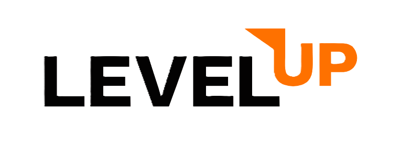
  
  <h3>AI-Powered Career Operating System & Autonomous Learning Path Recommender</h3>
  <p><em>Turn career ambition into daily execution with MiniMax-M3 LLM, Voice-First Tutoring, Vision Inspector & 1-Click Kanban Auto-Scheduling.</em></p>

  <p>
    <a href="https://level-up-new.vercel.app"></a>
    <a href="https://levelup-new-backend.onrender.com"></a>
    <a href="https://github.com/Prajeeth-12/LevelUP-new/tree/new-theme-layrs"></a>
  </p>

  <p>
    
    
    
    
    
    
  </p>
</div>

---

## 📌 Table of Contents
- [Executive Overview](#-executive-overview)
- [The Problem vs. LevelUP Solution](#-the-problem-vs-levelup-solution)
- [Visual Product Walkthrough & Screenshots](#-visual-product-walkthrough--screenshots)
  - [1. Authentication & Onboarding](#1-authentication--onboarding)
  - [2. Mission Control Dashboard](#2-mission-control-dashboard)
  - [3. Multimodal AI Assistant & Voice Tutor](#3-multimodal-ai-assistant--voice-tutor)
  - [4. 3-Column Kanban Board & 1-Click Auto-Scheduler](#4-3-column-kanban-board--1-click-auto-scheduler)
  - [5. Skill Gap Analyzer & Job Description Matcher](#5-skill-gap-analyzer--job-description-matcher)
  - [6. Conversational AI Learning Path Recommender](#6-conversational-ai-learning-path-recommender)
  - [7. Career Portfolio & Readiness Score](#7-career-portfolio--readiness-score)
  - [8. Engineering Analytics & Mastery Buckets](#8-engineering-analytics--mastery-buckets)
  - [9. User Profile, Settings & JSON Data Portability](#9-user-profile-settings--json-data-portability)
- [System Architecture](#-system-architecture)
- [Core API Reference](#-core-api-reference)
- [Local Setup & Execution Guide](#-local-setup--execution-guide)
- [Verified Production Deployments](#-verified-production-deployments)

---

## 💡 Executive Overview

**LevelUP** is an AI-powered personal career operating system engineered to bridge the modern software developer skill gap. Instead of overwhelming learners with static course catalogs or rigid checklists, LevelUP pairs each engineer with an active, multimodal AI mentor that dynamically benchmarks their skills against real-world job descriptions, schedules balanced Kanban sprints, and engages in voice-first 1-on-1 tutoring.

---

## 🎯 The Problem vs. LevelUP Solution

| Traditional Learning Platforms | The LevelUP OS Solution |
|---|---|
| **Course Overload:** Thousands of disconnected video lectures without structured sequencing. | **Goal-Driven Roadmaps:** AI breaks career targets into chronological, milestone-driven phases with prerequisites. |
| **Backlog Burnout:** Kanban boards accumulate hundreds of tasks without considering cognitive bandwidth. | **1-Click Auto-Scheduler:** Analyzes weekly hours (e.g. 12h/week) and isolates 2–4 high-leverage focus tasks for today's active sprint. |
| **Passive Consumption:** Watching tutorials produces an illusion of competence without active verification. | **Voice-First AI Tutor & Vision Inspector:** Spoken technical mock interviews and drag-and-drop system architecture verification. |
| **Vendor Lock-in:** Progress is trapped inside proprietary walled gardens. | **100% Data Portability:** One-click JSON data export of all categories, skills, tasks, and roadmaps. |

---

## 📸 Visual Product Walkthrough & Screenshots

### 1. Authentication & Onboarding
Seamless onboarding featuring our warm minimalist Layrs design system, Google One-Tap authentication, JWT Bearer verification, and inline password recovery.

<div align="center">
  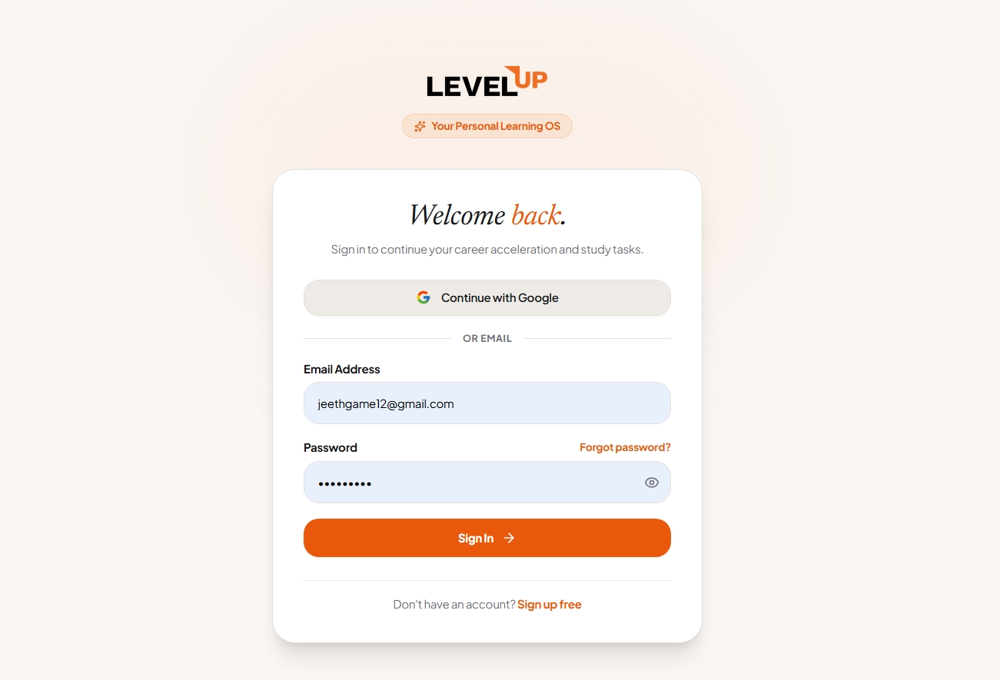
  <p><em>Figure 1: LevelUP Authentication Suite with Google OAuth and Email/Password flow</em></p>
</div>

---

### 2. Mission Control Dashboard
Central command center aggregating active career roadmaps, interactive daily knowledge prompts, cycle statistics, and today's priority tasks with a smooth fixed-rail sidebar.

<div align="center">
  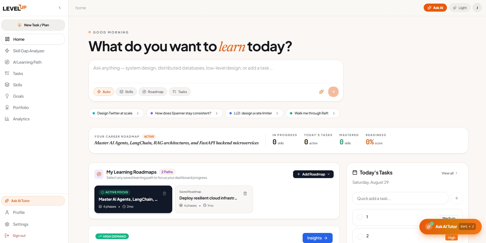
  <p><em>Figure 2: Core Dashboard featuring Daily Question Prompts, Cycle Stats Bar, and Multi-Roadmap Manager</em></p>
</div>

---

### 3. Multimodal AI Assistant & Voice Tutor
Embedded AI mentor powered by **MiniMax-M3 LLM** with real-time Speech-to-Text, spoken Text-to-Speech audio playback, diagram/whiteboard vision inspection, and **Human-in-the-Loop Action Cards** (`[+ Approve & Save]`).

<div align="center">
  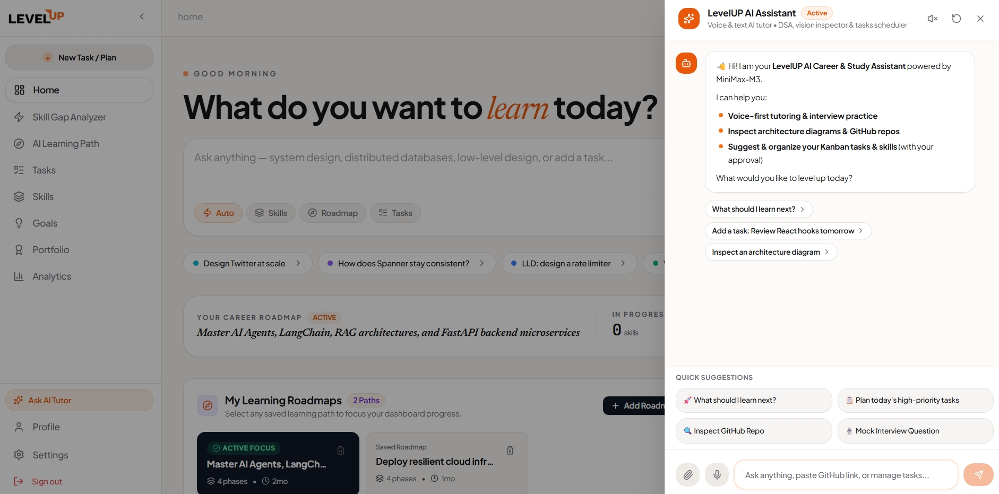
  <p><em>Figure 3: AI Chat Assistant with Voice Waveform, Vision Attachments, and Interactive Action Cards</em></p>
</div>

---

### 4. 3-Column Kanban Board & 1-Click Auto-Scheduler
Structured task execution categorized into **To Do**, **Current**, and **Past**. The **AI Auto-Schedule** button analyzes weekly study budgets and balances today's sprint automatically. Supports seamless instant theme toggling between Light and Dark modes.

<div align="center">
  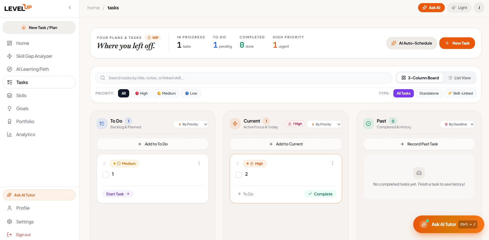
  <p><em>Figure 4: 3-Column Kanban Board in Light Theme with AI Auto-Schedule Engine</em></p>
  <br/>
  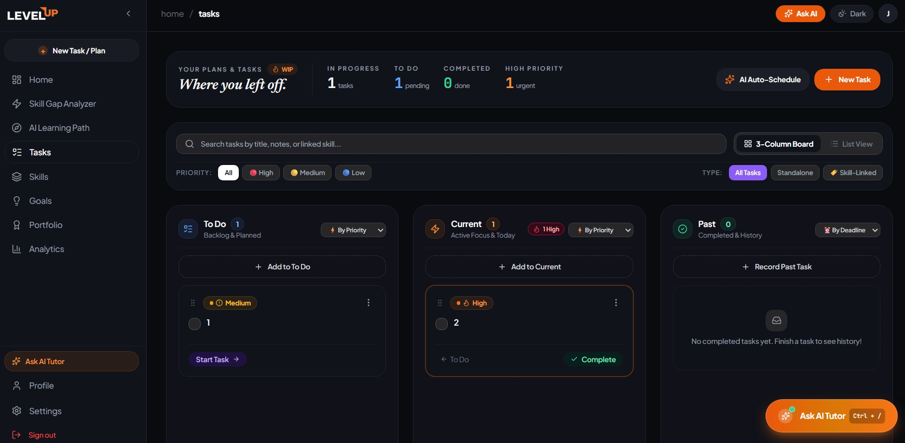
  <p><em>Figure 5: 3-Column Kanban Board in Dark Theme for late-night coding sessions</em></p>
</div>

---

### 5. Skill Gap Analyzer & Job Description Matcher
Upload an existing resume (PDF/DOCX/TXT), dial in your **Weekly Study Bandwidth** (4h to 40h/week), and match against target roles or raw job postings to extract missing skills and tailored milestones.

<div align="center">
  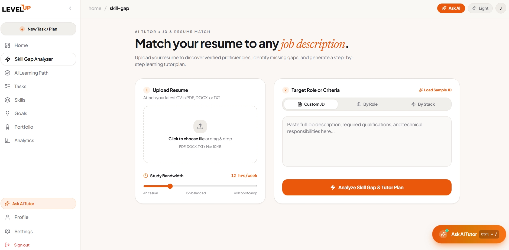
  <p><em>Figure 6: Skill Gap Analyzer with Resume Upload, Bandwidth Slider, and Custom JD Parser</em></p>
</div>

---

### 6. Conversational AI Learning Path Recommender
Describe learning objectives in natural language (*"Become an AI Agent Engineer in 8 weeks"*) or choose curated industry presets to synthesize multi-phase roadmaps with prerequisites and project deliverables.

<div align="center">
  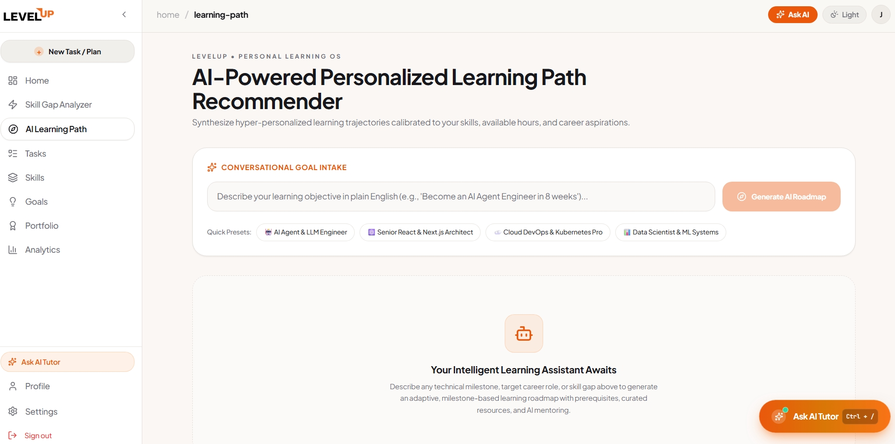
  <p><em>Figure 7: Conversational Goal Intake and Adaptive Learning Path Recommender</em></p>
</div>

---

### 7. Career Portfolio & Readiness Score
Verified proof of engineering competencies, readiness score aggregation, and one-click portfolio export for resume inclusion and hiring managers.

<div align="center">
  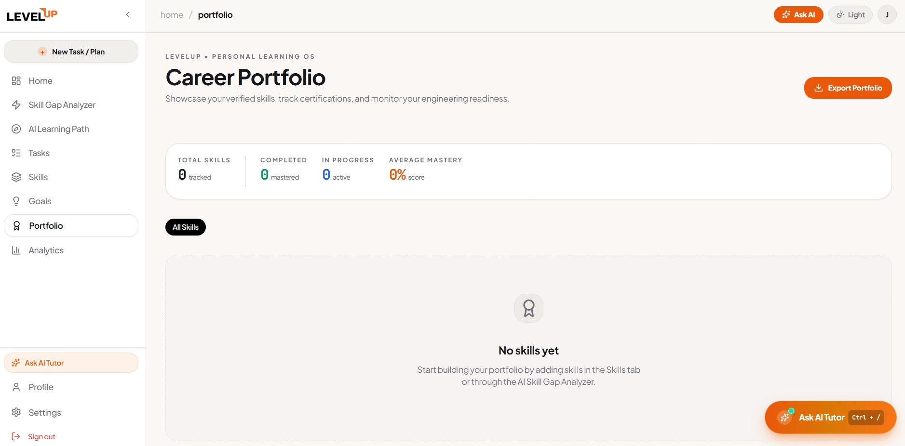
  <p><em>Figure 8: Career Portfolio with Mastery Stats and Export Portfolio Action</em></p>
</div>

---

### 8. Engineering Analytics & Mastery Buckets
Track learning velocity, task completion efficiency, study consistency streaks, and competency breakdowns across 5 mastery tiers (0% to 100%).

<div align="center">
  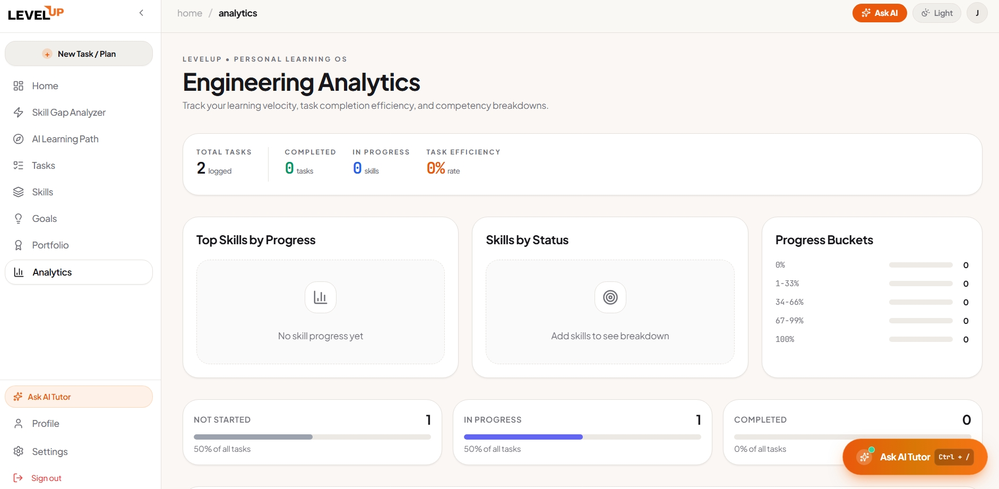
  <p><em>Figure 9: Engineering Analytics Dashboard with Task Efficiency and Progress Buckets</em></p>
</div>

---

### 9. User Profile, Settings & JSON Data Portability
Manage personal education credentials, multi-language/skill tags, and perform 1-click full database JSON backups with zero lock-in.

<div align="center">
  <table>
    <tr>
      <td width="50%">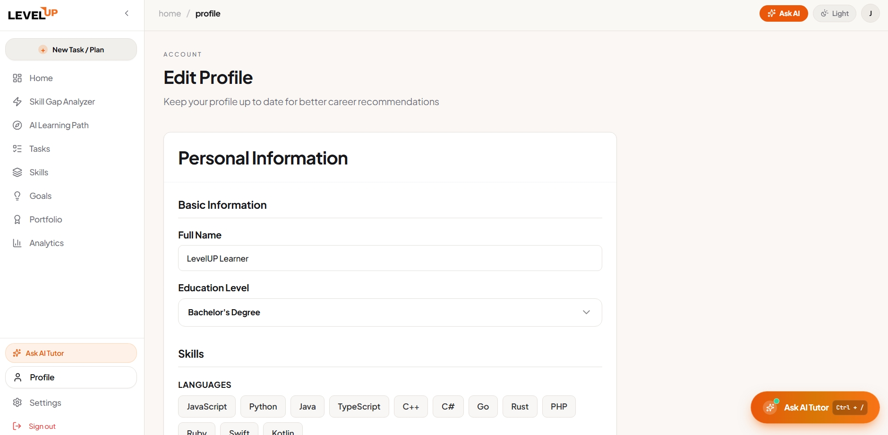</td>
      <td width="50%">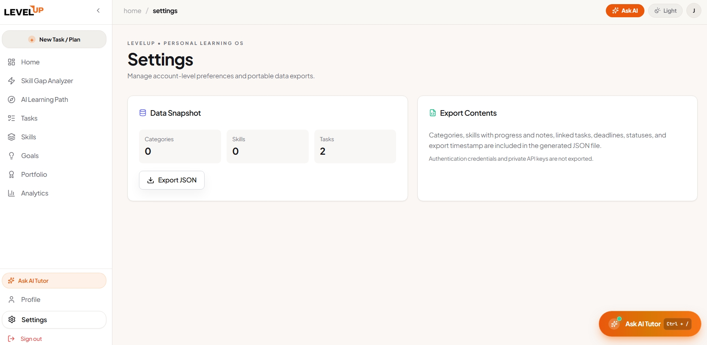</td>
    </tr>
    <tr>
      <td align="center"><em>Figure 10: User Profile & Skill Tags</em></td>
      <td align="center"><em>Figure 11: Settings & 1-Click JSON Data Export</em></td>
    </tr>
  </table>
</div>

---

## 🏗️ System Architecture

LevelUP is architected as a modular, asynchronous full-stack platform:

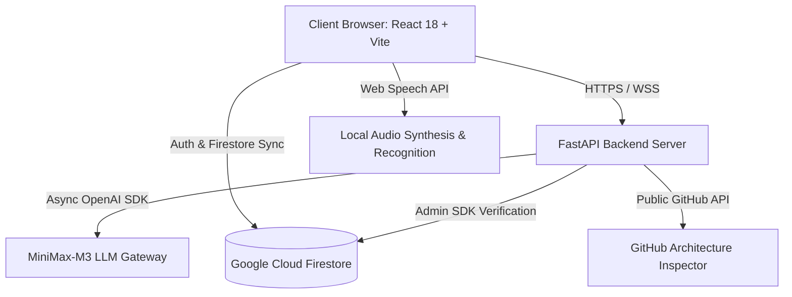

### Tech Stack Matrix:
- **Frontend:** React 18, Vite, Tailwind CSS, Lucide Icons, Framer Motion
- **Backend:** FastAPI (Python 3.10+), Uvicorn, Pydantic, Python-dotenv
- **AI Intelligence:** MiniMax-M3 LLM (via OpenAI-compatible API Gateway)
- **Database & Auth:** Google Cloud Firestore (NoSQL) & Firebase Authentication
- **Voice Engine:** Native Browser Web Speech Recognition & Speech Synthesis

---

## ⚡ Core API Reference

| Method | Endpoint | Description |
|---|---|---|
| `POST` | `/ai/chat` | Process multimodal chat queries with context, images, GitHub URLs, and action payloads. |
| `POST` | `/ai/auto-organize-tasks` | 1-Click Kanban sprint scheduler balancing weekly hour budgets. |
| `POST` | `/ai/skill-gap` | Benchmark resume skills against target role or pasted Job Description. |
| `POST` | `/ai/generate-subskills` | Decompose high-level skills into actionable subskill checklists. |
| `POST` | `/ai/task-plan` | Prioritize and sequence tasks based on available study time. |
| `POST` | `/ai/progress-insights` | Generate personalized coaching recommendations from activity logs. |
| `POST` | `/api/students/profile` | Create/update user student profile in Firestore. |
| `GET`  | `/api/career/roadmap` | Fetch active career learning roadmap for an authenticated user. |

---

## 🚀 Local Setup & Execution Guide

### 1. Prerequisites
- **Node.js** (v18+) & **Python** (v3.10+)
- **Git**

```bash
# Clone repository and switch to the active branch
git clone https://github.com/Prajeeth-12/LevelUP-new.git
cd LevelUP-new
git checkout new-theme-layrs
```

### 2. Backend Setup (FastAPI)
```bash
cd backend
python -m venv venv

# Activate Virtual Environment:
# Windows: .\venv\Scripts\activate
# macOS/Linux: source venv/bin/activate

pip install -r requirements.txt
```

Create `backend/.env`:
```env
PROJECT_NAME="LevelUP"
ENV="development"
MINIMAX_API_KEY="your-minimax-api-key"
MINIMAX_BASE_URL="https://api.gmi-serving.com/v1"
MINIMAX_MODEL="MiniMaxAI/MiniMax-M3"
FIREBASE_SERVICE_ACCOUNT_PATH="firebase-service-account.json"
```

Start backend:
```bash
python -m uvicorn app.main:app --port 8000 --reload
```
- API Base: `http://localhost:8000`
- Swagger Docs: `http://localhost:8000/docs`

### 3. Frontend Setup (React + Vite)
In a second terminal:
```bash
cd frontend
npm install
npm run dev -- --port 3000
```
- Web Application: `http://localhost:3000`

---

## 🌐 Verified Production Deployments

- **Live Application (Vercel):** [https://level-up-new.vercel.app](https://level-up-new.vercel.app)
- **Backend API Service (Render):** [https://levelup-new-backend.onrender.com](https://levelup-new-backend.onrender.com)
- **GitHub Repository:** [https://github.com/Prajeeth-12/LevelUP-new](https://github.com/Prajeeth-12/LevelUP-new) (Branch: `new-theme-layrs`)
- **Documentation (PDF):** [`docs/LevelUP_Solution_Documentation.pdf`](docs/LevelUP_Solution_Documentation.pdf)

---

<div align="center">
  <sub>Built with ❤️ for the LevelUP Engineering Challenge.</sub>
</div>
